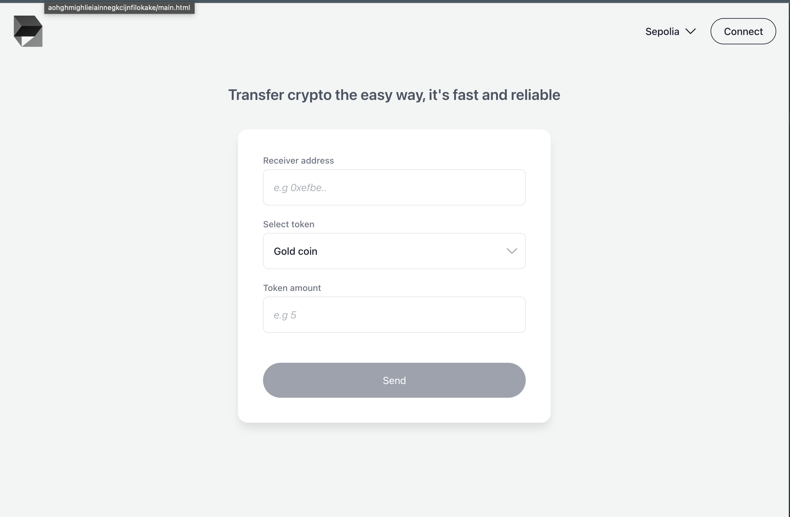
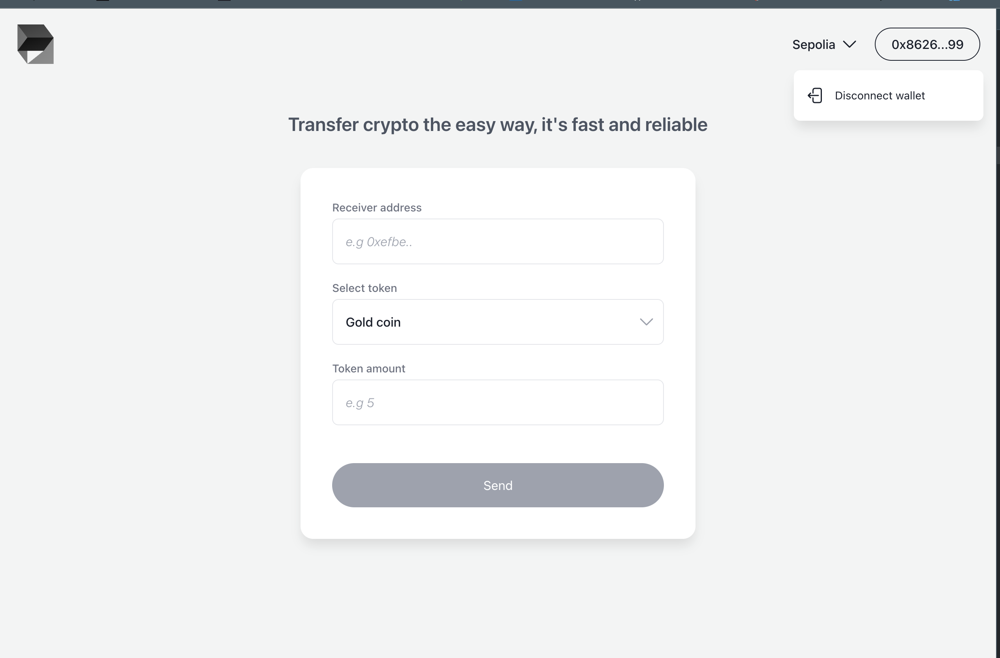
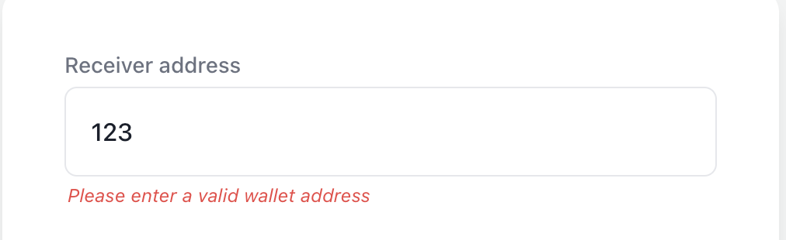
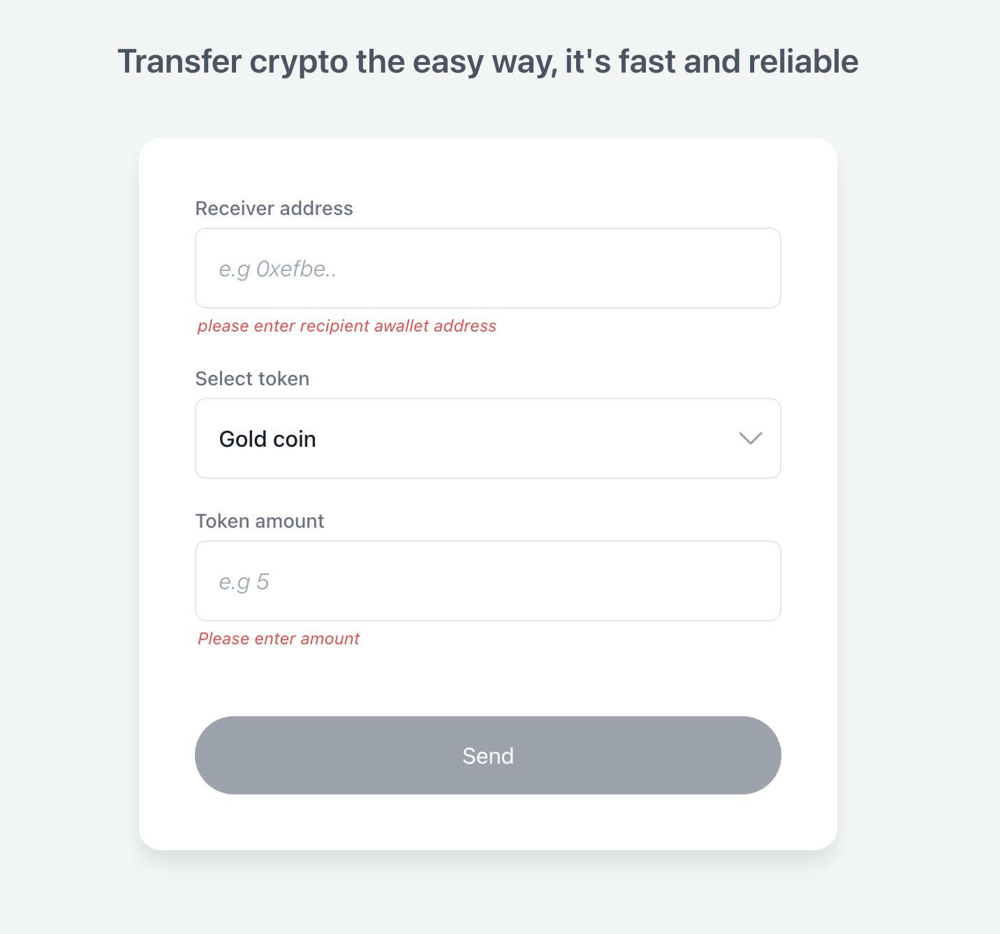
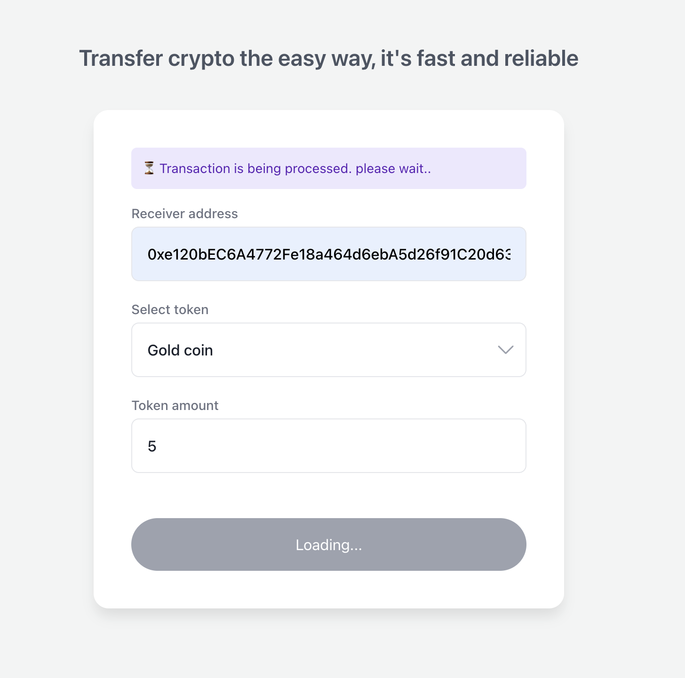
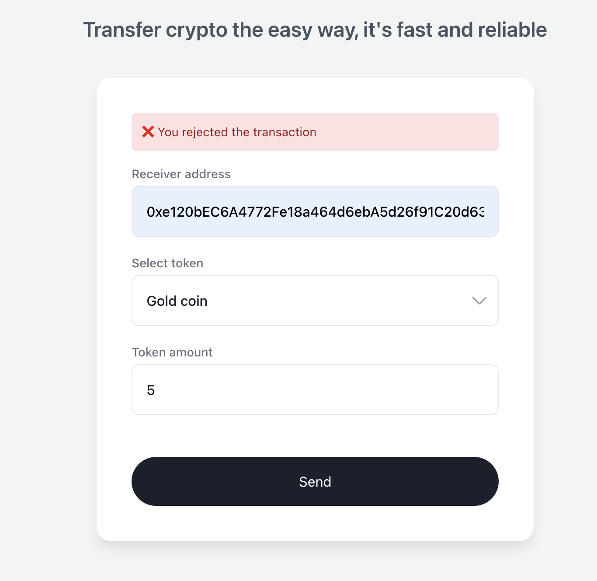
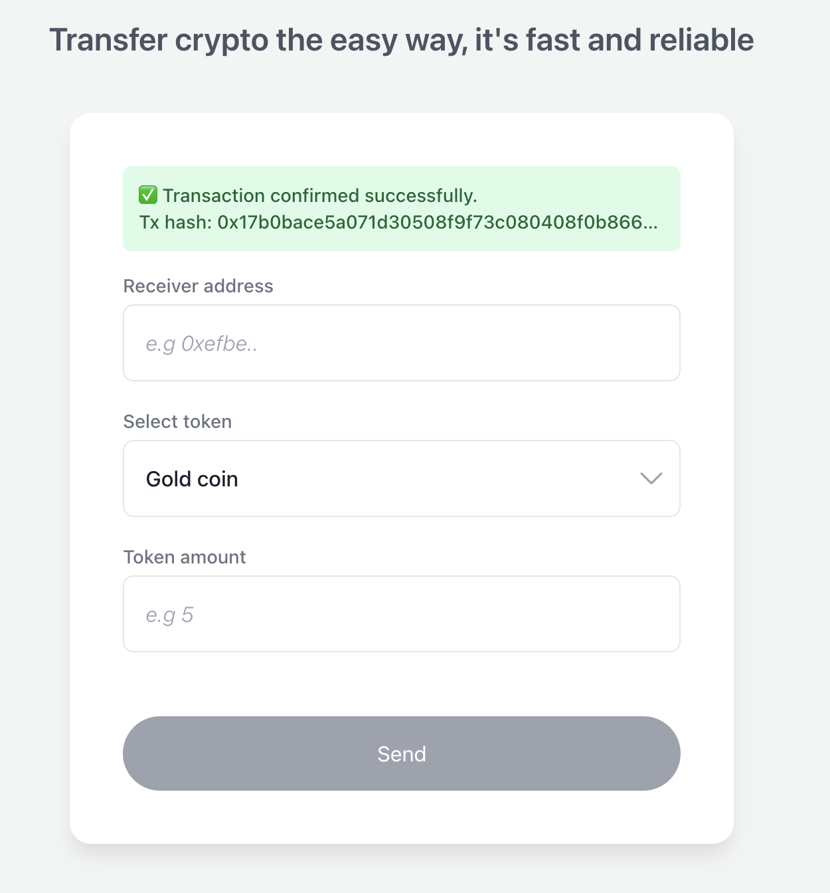

# Mock Asset DApp

A React-based decentralized application (DApp) that allows users to connect their Ethereum wallet, view mock assets, and transfer them to other addresses using a deployed smart contract.

---

# Project Overview

This project is a **React + TypeScript + Vite** decentralized application that interacts with a **mock asset smart contract** deployed locally using Hardhat.

The application allows users to:

- Connect or disconnect their Ethereum wallet
- View mock assets assigned to their wallet
- Claim starter assets from the smart contract
- Transfer assets to another Ethereum address
- View transaction status feedback (pending, success, error)

The goal of the project is to demonstrate a simple Web3 interaction flow including **wallet connection, smart contract interaction, and transaction feedback**.

---

# Folder Structure

```
src/
  components/     UI components
  hooks/          Custom React hooks
  services/       Wallet and contract service layers
  store/          Zustand state management
  lib/
    abi/          Smart contract ABI
    constants/    Contract address and supported chains
  utils/          Helper utilities
```

### Key Architecture Decisions

**Service Layer**

Direct interactions with the blockchain are abstracted into service modules:

- `walletService`
- `contractService`

This prevents components from interacting directly with `ethers.js` and improves maintainability.

---

**State Management**

The project uses **Zustand** with two different wallet-related stores.

### WalletUIStore (Persisted)

Stores UI preferences that can safely be persisted in `localStorage`.

Examples:

- Preferred chain
- Selected network
- Modal state

---

### WalletStore (Reactive Memory Store)

Stores **non-serializable runtime wallet state** such as:

- Provider
- Signer
- Wallet address
- Connection state
- Wallet errors

This store is **not persisted** to avoid issues with non-serializable values.

---

# Smart Contract

The application interacts with a **mock asset smart contract** deployed locally using Hardhat.

The contract allows users to:

- Claim starter assets
- Fetch assets owned by an address
- Transfer assets to another address

### Example Asset Structure

```ts
{
  id: 1,
  name: "Silver Coin",
  amount: 1000
}
```

---

### Smart Contract Repository

```
https://github.com/YOUR_USERNAME/mock-asset-contract
```

---

# Assumptions and Trade-offs

Several assumptions were made due to time constraints.

### Wallet Support

MetaMask was used as the primary wallet provider for simplicity.

---

### Web3 Library Choice

`ethers.js` was used for wallet connection and smart contract interactions.

---

### Local Smart Contract Deployment

The smart contract was deployed to a **local Hardhat node** instead of a public testnet.

This requires the reviewer to:

1. Run the local Hardhat node
2. Deploy the contract
3. Copy the generated contract address and ABI

These values should then be added to:

```
src/lib/constants/contracts.ts
src/lib/abi/web3LinkABI.ts
```

---

### Sepolia Deployment

Deployment to the Sepolia testnet was attempted but not completed due to issues with Alchemy configuration.

---

### Simplified Token Model

Assets are implemented as **simple object tokens stored within the contract** rather than using ERC20 or ERC1155 tokens.

This approach was chosen to keep the smart contract logic simpler for demonstration purposes.

---

### Wallet UX Flow

A full production-grade wallet connection and reconnection flow was not fully implemented due to time constraints.

However, comments were left in the code explaining how the connection lifecycle should be handled.

---

# Running the Project

## 1. Install Dependencies

```
npm install
```

or

```
yarn
```

---

## 2. Start the Development Server

```
npm run dev
```

or

```
yarn dev
```

---

## 3. Run Hardhat Node

In the smart contract repository:

```
npx hardhat node
```

---

## 4. Deploy the Smart Contract

```
npx hardhat ignition deploy ignition/modules/Web3LinkAssets.ts --network localhost
```

After deployment:

- Copy the **contract address**
- Copy the **ABI**

Paste them into:

```
src/lib/constants/contracts.ts
src/lib/abi/web3LinkABI.ts
```

---

## 5. Connect MetaMask to Localhost

Add the Hardhat network:

```
Network Name: Hardhat Localhost
RPC URL: http://127.0.0.1:8545
Chain ID: 31337
```

Import one of the test accounts using the secret key provided by Hardhat.

---

# Tests

Due to time constraints, automated tests were not implemented.

However, the architecture allows easy integration using testing frameworks such as:

- **Vitest**
- **Jest**
- **React Testing Library**

Smart contract testing can also be implemented using:

- **Hardhat tests**
- **Foundry tests**

---

# Bonus Features Implemented

### UI Styling

The interface uses:

- **TailwindCSS**
- **Headless UI**

for accessible and composable UI components.

---

### Transaction Status Feedback

The application provides user feedback during transaction lifecycle:

- Pending
- Success
- Error
- User rejected transaction

---

### Multi-Chain Support (Initial Setup)

Basic infrastructure was added for **multi-chain support**, including:

- Chain configuration constants
- Network selection UI
- Chain switching through MetaMask

---

# Screenshots / Demo

```













```

---

# Future Improvements

Potential improvements if this were extended further:

- Deploy contract to Sepolia testnet
- Add ERC20/ERC1155 based token architecture
- Improve wallet reconnection UX
- Add transaction history tracking
- Implement automated tests
- Add WalletConnect support
- Add blockchain client abstraction layer

---

# License

This project was created as part of a technical assignment.
